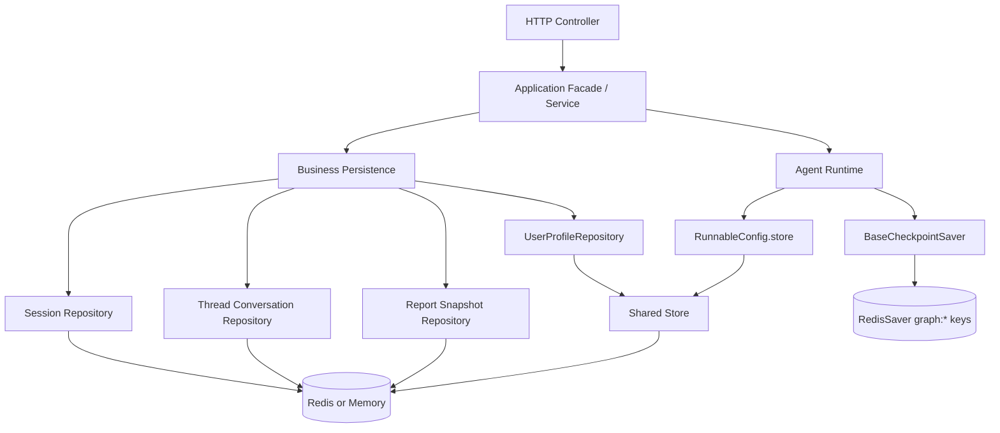
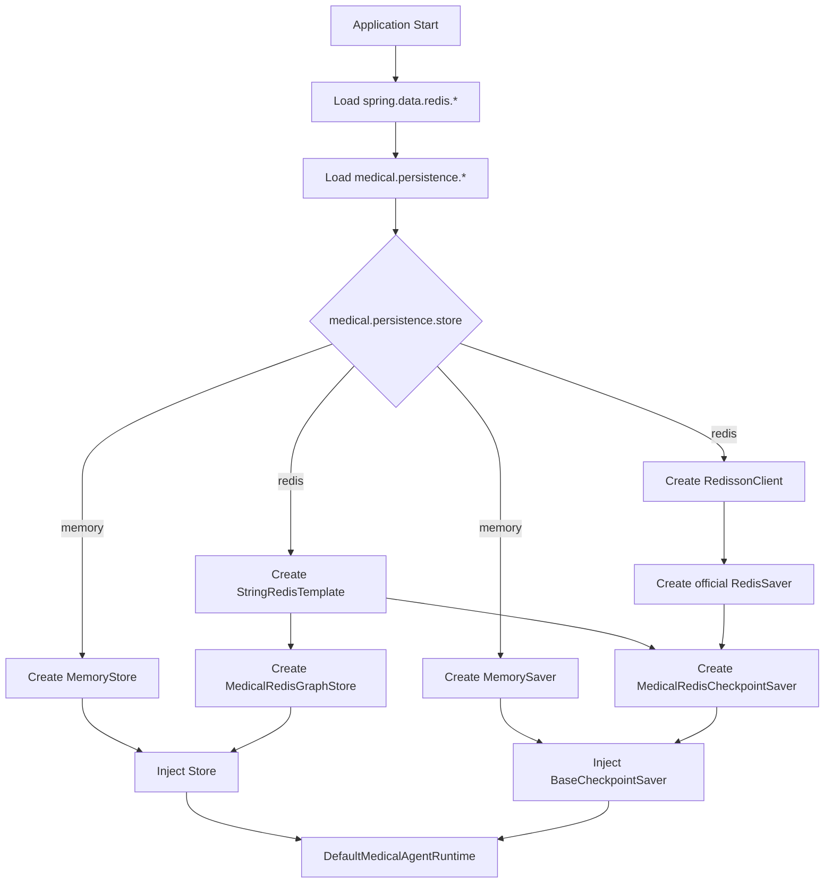
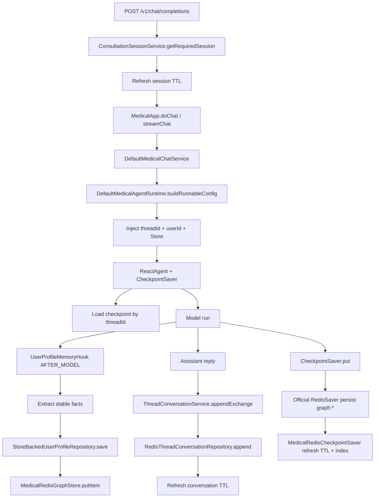
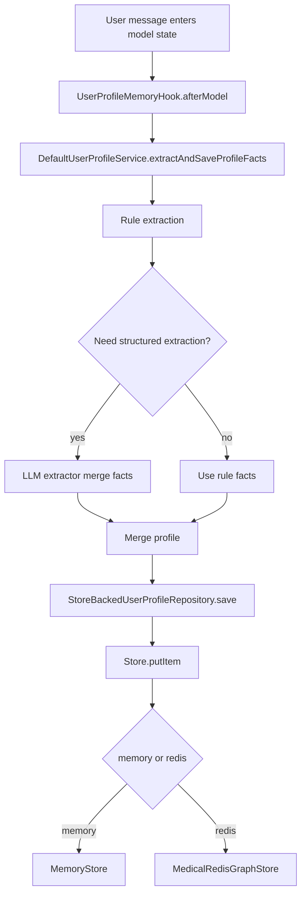
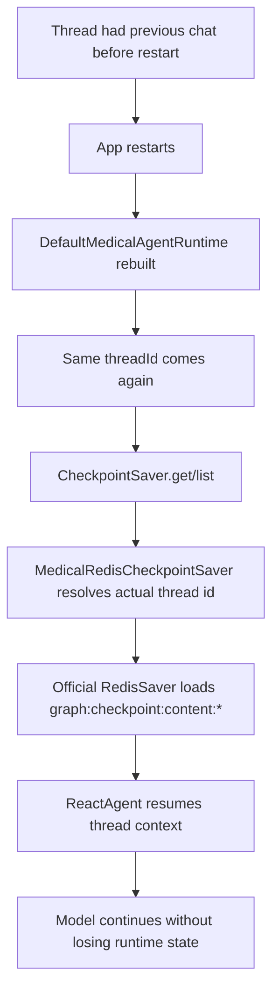

# Redis 全链路持久化技术文档与性能评估

## 1. 背景与目标

本次 Redis 收敛的目标，不是简单把若干 Repository 从内存切到 Redis，而是把 MedicalAgent 当前“预埋但未正式启用”的持久化能力，收敛成一套可以用于真实环境验证和生产部署的正式方案。

覆盖范围分为两层：

- 业务态持久化
  - `session`
  - `thread conversation`
  - `user profile`
  - `report snapshot`
- Runtime 态持久化
  - Agent `checkpoint saver`
  - `RunnableConfig.store`

设计目标如下：

- 保留 `medical.persistence.store=memory|redis` 双模式切换能力
- `memory` 继续作为本地轻量模式
- `redis` 作为正式持久化模式
- 让业务态和 Runtime 态共享同一套 Redis 基础设施
- 避免 Runtime user profile store 与业务 Repository 双份数据漂移
- 让服务重启后仍可复用会话、历史对话、用户画像、报告快照和线程 checkpoint

---

## 2. 官方基线与项目偏离

### 2.1 官方基线

本次收敛方案的官方参考基线来自：

- Java2AI Graph Persistence  
  https://java2ai.com/en/docs/frameworks/graph-core/core/persistence
- Java2AI Agent Memory Tutorial  
  https://java2ai.com/docs/frameworks/agent-framework/tutorials/memory/

官方基线提供了两类关键能力：

- Checkpoint Saver：用于保存 Agent thread 的运行状态
- Store：用于在 `RunnableConfig.store(...)` 中挂载长期记忆或共享存储

### 2.2 项目明确偏离点

本项目没有完全照搬官方默认实现，而是保留了两处关键偏离：

#### 偏离 1：Checkpoint Saver 采用官方 `RedisSaver`

Runtime checkpoint 采用官方 `RedisSaver` 作为基线实现，再在外层包装 `MedicalRedisCheckpointSaver`，补充项目所需能力：

- 逻辑线程名到实际 saver thread key 的索引维护
- checkpoint 相关 key 的 TTL 刷新
- 与项目统一的清理策略联动

原因：

- 官方 `RedisSaver` 已具备线程级 checkpoint 的基础能力
- 项目只需要在其外层补足 TTL 和可清理性，而不是重写 checkpoint 协议本身

#### 偏离 2：Store 不直接使用框架内置 `RedisStore`

Runtime store 没有直接使用框架自带 `RedisStore`，而是保留项目自定义 `MedicalRedisGraphStore implements Store`。

原因：

- 基于本地 `spring-ai-alibaba-graph-core 1.1.2.0` 依赖检查，框架内置 `RedisStore` 当前实现内部是 `redisLikeStorage` 的内存 Map，并不是真实 Redis 落地
- 项目还需要保留以下约束，而这些约束内置实现无法满足
  - `medical.persistence.store` 模式切换
  - 统一 TTL
  - 业务 key-prefix
  - 正式环境可观测与可清理
  - Runtime Store 与 `UserProfileRepository` 的单一事实源

因此，本项目当前正式方案为：

- Checkpoint：官方 `RedisSaver` + 项目包装器
- Store：项目自定义真实 Redis 实现

---

## 3. 配置模型

### 3.1 配置入口

Redis 正式接入后，配置分成两层：

#### Spring Redis 连接配置

```yaml
spring:
  data:
    redis:
      host: ${SPRING_DATA_REDIS_HOST:127.0.0.1}
      port: ${SPRING_DATA_REDIS_PORT:6379}
      username: ${SPRING_DATA_REDIS_USERNAME:}
      password: ${SPRING_DATA_REDIS_PASSWORD:}
      database: ${SPRING_DATA_REDIS_DATABASE:3}
      timeout: ${SPRING_DATA_REDIS_TIMEOUT:5s}
```

这一层统一作为以下组件的连接来源：

- `StringRedisTemplate`
- `RedissonClient`

#### Medical 持久化策略配置

```yaml
medical:
  persistence:
    store: ${MEDICAL_PERSISTENCE_STORE:redis}
    redis:
      key-prefix: ${MEDICAL_REDIS_KEY_PREFIX:medical-agent:}
      session-ttl: ${MEDICAL_REDIS_SESSION_TTL:12h}
      conversation-ttl: ${MEDICAL_REDIS_CONVERSATION_TTL:72h}
      profile-ttl: ${MEDICAL_REDIS_PROFILE_TTL:720h}
      snapshot-ttl: ${MEDICAL_REDIS_SNAPSHOT_TTL:30m}
```

这一层控制：

- 当前使用 `memory` 还是 `redis`
- 业务态 key 前缀
- 各类业务数据和 Runtime 数据的 TTL

### 3.2 配置语义

| 配置项 | 作用 |
| --- | --- |
| `medical.persistence.store` | 持久化模式切换，`memory` 或 `redis` |
| `medical.persistence.redis.key-prefix` | 业务态 Redis key 前缀，也是项目自定义 graph-store / checkpoint-index 的前缀 |
| `session-ttl` | 前端 `sessionId` 生命周期 |
| `conversation-ttl` | 对话历史 TTL，同时复用于 checkpoint TTL |
| `profile-ttl` | 用户画像 TTL，同时复用于 graph-store TTL |
| `snapshot-ttl` | 报告快照 TTL |

### 3.3 环境隔离要求

建议每个环境使用独立 Redis DB 或独立 Redis 实例，不共享 DB。

原因：

- 官方 `RedisSaver` 使用 `graph:*` 前缀
- 这部分 key 前缀不是项目侧可配置项
- 若多个环境共用同一 DB，会增大观测、清理和排障风险

---

## 4. 总体架构

### 4.1 架构分层



### 4.2 两条主线

#### 业务态主线

负责可直接用于业务重建和接口响应的数据：

- session
- 对话历史
- 用户画像
- 报告快照

其中，报告内容的 authority 仍然是：

- `ThreadConversationRepository`
- `MedicalReportSnapshotRepository`

而不是 Runtime checkpoint。

#### Runtime 态主线

负责 Agent 执行连续性的状态：

- checkpoint saver
- 共享 store

Runtime 态的目标是“让同一 thread 在服务重启后仍能续接”，不是替代业务态报表重建逻辑。

---

## 5. 模块拆解

### 5.1 Redis 基础设施模块

核心职责：

- 从 `spring.data.redis.*` 读取真实连接信息
- 统一创建 `StringRedisTemplate`
- 在 `redis` 模式下创建 `RedissonClient`
- 启动时输出模式、Redis DB、业务 key-prefix

关键类：

- `MedicalPersistenceProperties`
- `MedicalAgentStoreConfiguration`

行为说明：

- `memory` 模式下：
  - `Store` 返回 `MemoryStore`
  - `BaseCheckpointSaver` 返回 `MemorySaver`
- `redis` 模式下：
  - `Store` 返回 `MedicalRedisGraphStore`
  - `BaseCheckpointSaver` 返回 `MedicalRedisCheckpointSaver`
  - `MedicalRedisCheckpointSaver` 内部委托官方 `RedisSaver`

### 5.2 Session 持久化模块

核心职责：

- 为前端 `sessionId` 建立稳定映射
- 记录 `sessionId -> threadId / userId / location`
- 在每次访问时刷新活跃时间和 TTL

关键类：

- `ConsultationSessionService`
- `RedisConsultationSessionRepository`

数据特点：

- 单 key 单对象
- JSON 序列化
- TTL 由 `session-ttl` 控制

### 5.3 Thread Conversation 持久化模块

核心职责：

- 记录线程级原始对话历史
- 作为报告生成与快照指纹计算的事实来源

关键类：

- `DefaultThreadConversationService`
- `RedisThreadConversationRepository`

数据特点：

- 每个 `threadId` 一条 Redis List
- 每轮问答按顺序追加 `user -> assistant`
- 读取时刷新 TTL
- 清空时按前缀批量删除

### 5.4 User Profile 持久化模块

核心职责：

- 从用户对话中抽取稳定事实
- 保存长期画像
- 在后续请求中作为长期记忆注入 Runtime

关键类：

- `DefaultUserProfileService`
- `UserProfileMemoryHook`
- `StoreBackedUserProfileRepository`
- `MedicalRedisGraphStore`

关键收敛点：

- 业务 Repository 与 Runtime `RunnableConfig.store(...)` 共用同一个底层 `Store`
- 不再拆成 memory/redis 两份用户画像状态
- 用户画像成为真正的单一事实源

### 5.5 Report Snapshot 持久化模块

核心职责：

- 冻结一次完整报告输出
- 用于 `/reports/{sessionId}` 和 `/reports/{sessionId}/pdf` 的快速复用
- 通过 conversation/profile/location fingerprint 判断是否可复用

关键类：

- `DefaultMedicalReportSnapshotService`
- `RedisMedicalReportSnapshotRepository`

关键规则：

- 若上下文 fingerprint 未变化，则复用已有 snapshot
- 若位置变化，只失效 report snapshot
- 不清 conversation、profile、checkpoint

### 5.6 Runtime Checkpoint 模块

核心职责：

- 保存 Agent thread checkpoint
- 支持服务重启后续接同一逻辑线程
- 通过 TTL 防止 checkpoint 无限增长

关键类：

- `DefaultMedicalAgentRuntime`
- `MedicalRedisCheckpointSaver`
- 官方 `RedisSaver`

包装器职责：

- 在 `put/get/list/release` 后刷新 checkpoint 相关 key 的 TTL
- 维护逻辑线程名到实际 saver thread id 的索引
- 让 Runtime 清理器可以补删项目自定义索引 key

### 5.7 Runtime Store 模块

核心职责：

- 作为 `RunnableConfig.store(...)` 的真实持久化底座
- 保存长期记忆类 `StoreItem`
- 与 `StoreBackedUserProfileRepository` 共用

关键类：

- `MedicalRedisGraphStore`

实现特点：

- key 统一落在 `medical.persistence.redis.key-prefix + "graph-store:"`
- 使用真实 Redis String 存储 JSON 化 `StoreItem`
- 支持 `put/get/delete/search/list/clear`
- `search/list/clear` 使用 `SCAN`
- TTL 默认复用 `profile-ttl`

### 5.8 统一清理模块

核心职责：

- 把 `clearMemory()` 升级为“清空当前持久层状态”
- 同时清理业务态与 Runtime 态数据

关键类：

- `MedicalApp`
- `MedicalAgentRuntimePersistenceCleaner`

清理范围：

- 线程对话
- RAG 上下文
- 报告快照
- report build coordinator
- graph-store
- checkpoint 相关 key
- Runtime 实例缓存

---

## 6. Redis Key 设计与数据模型

### 6.1 业务态 Key

| 模块 | Key Pattern | Redis 类型 | TTL | 说明 |
| --- | --- | --- | --- | --- |
| Session | `{prefix}session:{sessionId}` | String | `session-ttl` | JSON 化 `ConsultationSession` |
| Thread Conversation | `{prefix}thread-conversation:{threadId}` | List | `conversation-ttl` | 每个元素是一条 JSON 化消息 |
| Report Snapshot | `{prefix}report-snapshot:{sessionId}` | String | `snapshot-ttl` | JSON 化 `MedicalReportSnapshot` |
| Graph Store | `{prefix}graph-store:{namespacePath}:{key}` | String | `profile-ttl` | JSON 化 `StoreItem` |
| Checkpoint Index | `{prefix}checkpoint-index:{logicalThreadId}` | String | `conversation-ttl` | 逻辑线程到实际 checkpoint thread id 的映射 |

其中：

- `prefix` 默认为 `medical-agent:`
- `namespacePath` 由 `StoreItem.namespace` 拼装

### 6.2 官方 `RedisSaver` 相关 Key

| Key Pattern | Redis 类型 | TTL 控制 | 说明 |
| --- | --- | --- | --- |
| `graph:thread:meta:{logicalThreadId}` | Hash | 由包装器刷新 | 官方线程元数据，包含 `thread_id` / `is_released` |
| `graph:thread:reverse:{actualThreadId}` | Hash | 由包装器刷新 | 官方反向索引，包含 `thread_name` / `is_released` |
| `graph:checkpoint:content:{actualThreadId}` | Bucket/String-like | 由包装器刷新 | 官方 checkpoint 内容 |
| `graph:checkpoint:lock:{logicalThreadId}` | Lock | 由包装器刷新 | 官方线程锁 |

注意：

- 业务侧不应直接依赖 `graph:*` value schema
- 项目只依赖其 key pattern、续接语义和 TTL 刷新能力
- 报告重建不读取 checkpoint 内容

### 6.3 TTL 设计原则

| 数据 | 默认 TTL | 设计意图 |
| --- | --- | --- |
| Session | 12h | 保留短期会话连续性 |
| Conversation | 72h | 支撑近几日问诊续接和报告重建 |
| Profile | 30d | 保留长期画像 |
| Snapshot | 30m | 报告快速复用，避免长期脏缓存 |
| Checkpoint | 72h | 与 conversation 同步，保证线程连续性 |

---

## 7. 模块 Workflow

### 7.1 启动装配 Workflow



#### 说明

- `Store` 始终以抽象类型注入
- `memory` 和 `redis` 模式只在装配层分叉
- 业务服务层和 Runtime 层不需要感知底层是内存还是 Redis

### 7.2 聊天请求 Workflow



#### 说明

- 用户画像提取发生在模型调用之后
- 对话历史与 checkpoint 同时持久化，但职责不同
- conversation 是报告 authority，checkpoint 是 Agent 续接状态

### 7.3 用户画像 Workflow



#### 说明

- Repository 不再区分 memory-profile 和 redis-profile 两套实现
- 同一份 Store 既服务 Runtime，也服务业务查询

### 7.4 报告查询与快照复用 Workflow

```mermaid
flowchart TD
    A[GET /v1/reports/{sessionId}] --> B[ConsultationSessionService.getRequiredSession]
    B --> C[MedicalApp.getFinalReportStatus]
    C --> D[ReportBuildCoordinator.getOrStartFinalReport]
    D --> E[DefaultMedicalReportSnapshotService.findFreshSnapshot]
    E --> F[Load snapshot by sessionId]
    F --> G{Snapshot exists and fingerprint fresh?}
    G -->|yes| H[Return existing snapshot]
    G -->|no| I[Load conversation transcript]
    I --> J[Load user profile context]
    J --> K[Resolve planning intent]
    K --> L[Build report + planning]
    L --> M[Save MedicalReportSnapshot]
    M --> N[Return new snapshot]
```

#### 说明

- 快照是否可复用，取决于 conversation/profile/location fingerprint
- 位置更新后只会让 snapshot 失效
- conversation / profile / checkpoint 仍保留

### 7.5 服务重启后线程续接 Workflow



#### 说明

- 这是 Redis 模式对 Runtime 最核心的价值
- 没有 Redis 时，进程级 Runtime 状态会随重启丢失

### 7.6 `clearMemory()` Workflow

```mermaid
flowchart TD
    A[Call MedicalApp.clearMemory] --> B[Clear thread conversations]
    A --> C[Clear RAG context holder]
    A --> D[Clear report snapshots]
    A --> E[Clear report build coordinator]
    A --> F[MedicalAgentRuntimePersistenceCleaner.clearAll]
    A --> G[Reset MedicalAgentRuntime]

    F --> H[Store.clear]
    F --> I{redis mode?}
    I -->|no| J[End]
    I -->|yes| K[SCAN graph:thread:meta:*]
    I -->|yes| L[SCAN graph:thread:reverse:*]
    I -->|yes| M[SCAN graph:checkpoint:content:*]
    I -->|yes| N[SCAN graph:checkpoint:lock:*]
    I -->|yes| O[SCAN {prefix}checkpoint-index:*]
    K --> P[Bulk delete]
    L --> P
    M --> P
    N --> P
    O --> P
```

#### 说明

- `clearMemory()` 现在已不是“只清 JVM 内存”
- 在 Redis 模式下，它会清空当前持久层状态

---

## 8. Repository / Runtime 交互关系

### 8.1 业务态 authority

以下数据属于业务态 authority：

- Session：由 `ConsultationSessionRepository` 管理
- Conversation：由 `ThreadConversationRepository` 管理
- Report Snapshot：由 `MedicalReportSnapshotRepository` 管理
- User Profile：由 `StoreBackedUserProfileRepository` 管理

其中，报告内容重建只依赖：

- conversation transcript
- user profile context
- location
- existing report snapshot freshness

不依赖 checkpoint。

### 8.2 Runtime authority

以下数据属于 Runtime authority：

- Agent thread checkpoint
- Runtime store 中的长期记忆数据

其职责是：

- 提升同一逻辑线程的续接能力
- 减少服务重启后 Agent 上下文完全丢失的问题

其不承担：

- 直接对外输出报告
- 作为报表查询 authority

---

## 9. 清理与生命周期策略

### 9.1 TTL 刷新策略

| 数据 | 刷新时机 |
| --- | --- |
| Session | `findBySessionId` / `getRequiredSession` 后 |
| Conversation | `append` / `findByThreadId` 后 |
| Snapshot | `findBySessionId` / `save` 后 |
| Graph Store | `putItem` / `getItem` 后 |
| Checkpoint | `put/get/list/release` 后 |

### 9.2 为什么要把 `KEYS` 改成 `SCAN`

`RedisJsonValueSupport` 已将批量删除从 `KEYS` 改为 `SCAN`。

原因：

- `KEYS pattern` 会阻塞 Redis 主线程
- 正式环境 key 数量增大后，存在明显风险
- `SCAN` 支持分页遍历，更适合生产环境清理和巡检

### 9.3 位置更新的语义

`POST /v1/reports/{sessionId}/location` 后：

- 会更新 session 中的位置字段
- 会失效报告 snapshot
- 不会删除 conversation
- 不会删除 profile
- 不会删除 checkpoint

这保证了：

- 既能重算路线规划
- 又不破坏已积累的会话上下文与长期画像

---

## 10. 生产验证步骤

### 10.1 最小验证前提

若你已经：

- 在后台启动 Redis
- 分配 `database 3`
- 将 `application.yml` 中 `medical.persistence.store` 切到 `redis`

那么 Redis 本身不需要额外手动创建表结构、数据类型或预置 key。

本方案的所有数据结构，都会在应用运行过程中自动写入 Redis。

### 10.2 推荐配置

```yaml
spring:
  data:
    redis:
      host: 127.0.0.1
      port: 6379
      database: 3

medical:
  persistence:
    store: redis
    redis:
      key-prefix: medical-agent:
      session-ttl: 12h
      conversation-ttl: 72h
      profile-ttl: 720h
      snapshot-ttl: 30m
```

### 10.3 启动后预期日志

启动时应看到类似日志：

- 当前处于 `redis mode`
- 当前使用的 `redisDb`
- 当前业务 `key-prefix`

且不会打印密码。

### 10.4 推荐验收动作

#### 场景 1：业务态验证

1. 创建一个新 session
2. 发起多轮聊天
3. 查看 Redis 中是否出现
   - `medical-agent:session:*`
   - `medical-agent:thread-conversation:*`
   - `medical-agent:graph-store:*`
4. 触发报告生成
5. 查看 Redis 中是否出现 `medical-agent:report-snapshot:*`

#### 场景 2：跨重启验证

1. 保持 Redis 不清空
2. 重启应用
3. 用同一个 `sessionId` 再次访问聊天和报告接口
4. 预期结果
   - session 仍可读取
   - 历史对话仍可读取
   - 用户画像仍可读取
   - 报告快照仍可读取

#### 场景 3：Runtime 续接验证

1. 使用同一个 `threadId` 完成第一次聊天
2. 重启应用
3. 再用同一个 `threadId` 发起第二次聊天
4. 预期 Agent 能续接已有线程上下文

#### 场景 4：位置更新验证

1. 先生成一份报告
2. 更新位置
3. 再次查询报告
4. 预期
   - snapshot 被重建
   - conversation / profile / checkpoint 未丢失

### 10.5 观测建议

可用以下命令查看 DB 3 的 key：

```bash
redis-cli -n 3 --scan --pattern 'medical-agent:*'
redis-cli -n 3 --scan --pattern 'graph:*'
```

查看 TTL：

```bash
redis-cli -n 3 ttl medical-agent:session:<sessionId>
redis-cli -n 3 ttl medical-agent:checkpoint-index:<threadId>
```

---

## 11. 测试覆盖情况

### 11.1 已补充的测试

#### 单元测试

- `MedicalAgentStoreConfigurationTest`
  - 验证 `memory` 模式下选择 `MemoryStore + MemorySaver`
  - 验证 `redis` 模式下选择 `MedicalRedisGraphStore + MedicalRedisCheckpointSaver`
- `MedicalRedisGraphStoreTest`
  - 验证 `put/get/search/list/clear`
- `MedicalRedisCheckpointSaverTest`
  - 验证 checkpoint 持久化、实际 thread id 索引与 TTL 刷新
- `MedicalAgentRuntimePersistenceCleanerTest`
  - 验证清理器在 `memory` / `redis` 下的不同行为

#### 集成测试

- `MedicalRedisPersistenceIT`
  - 覆盖 session / conversation / profile / snapshot
- `DefaultMedicalAgentRuntimeRedisIT`
  - 覆盖 Runtime reset 后同一 thread 的上下文续接

### 11.2 当前验证边界

当前代码层与本地编译已通过，但若要完成“真实生产环境验证”，仍建议跑一轮真实应用进程对真实 Redis DB 3 的端到端验证。

原因：

- Testcontainers 侧验证的是隔离容器内 Redis
- 本地 Docker 状态、网络、配置注入路径与生产运行方式可能仍有差异

---

## 12. 性能评估与速度收益判断

### 12.1 结论先行

加入 Redis 之后，系统的收益主要来自：

- 状态复用
- 重启恢复
- 多实例连续性
- 避免重复构建报告或重复丢失上下文

而不是来自“单机内存访问被 Redis 访问替代后更快”。

换句话说：

- 对单次本地热路径读写，Redis 通常不会比内存更快
- 对跨重启、跨实例、可复用场景，Redis 会显著降低整体等待时间和重复计算成本

### 12.2 为什么 Redis 不会让单次热路径比内存更快

`memory` 模式本质上是 JVM 进程内对象访问：

- 无网络 hop
- 无序列化往返
- 无 Redis 协议解析

而 `redis` 模式至少增加了：

- JSON 序列化/反序列化
- 网络往返
- Redis 命令处理
- Spring Data Redis / Redisson 客户端调用开销

因此，在单节点、单进程、未重启的情况下：

- session/profile/snapshot/store 的单次读写，Redis 多数会比内存略慢
- 常见量级通常是多出约 `0.3ms ~ 2ms` 的存储开销
- 若网络跨可用区或 Redis 负载较高，这个增量会继续放大

### 12.3 本机 Redis 基准参考

本机对 Redis DB 3 跑了一组轻量 benchmark：

```bash
redis-benchmark -n 2000 -q -d 256 -t set,get,hset,hget,lpush,lrange -c 20 -P 4 -r 1000 --dbnum 3
```

结果如下：

| 操作 | 吞吐 | p50 延迟 |
| --- | --- | --- |
| `SET` | `44444.44 req/s` | `0.791 ms` |
| `GET` | `200000.00 req/s` | `0.335 ms` |
| `HSET` | `222222.23 req/s` | `0.335 ms` |
| `LPUSH` | `200000.00 req/s` | `0.359 ms` |
| `LRANGE_100` | `47619.05 req/s` | `0.383 ms` |
| `LRANGE_300` | `17241.38 req/s` | `0.543 ms` |
| `LRANGE_500` | `8888.89 req/s` | `0.911 ms` |
| `LRANGE_600` | `7782.10 req/s` | `1.111 ms` |

这组数字只能说明：

- 本机 Redis 对中小 payload 的基础读写延迟大约在亚毫秒到 1 毫秒级
- 它适合做在线持久化与状态复用
- 但它并不是“比 JVM 内存更快”的替代品

这不是生产 SLA，也不能直接外推为线上承诺。

### 12.4 哪些路径会真正变快

#### 场景 1：重启后继续读取已有 session / snapshot

没有 Redis 时：

- 进程重启后内存态丢失
- 需要重新建立上下文，甚至重新触发报告构建

有 Redis 时：

- 直接读取 session、conversation、profile、snapshot
- 对于已存在且仍 fresh 的 snapshot，请求会变成一次存储读取 + 控制层封装

因此这类路径的收益不是“从 5ms 变 3ms”，而更接近：

- 从“秒级重建或完全不可复用”
- 变成“毫秒级到百毫秒级读取返回”

#### 场景 2：报告快照复用

报告构建路径往往包含：

- conversation transcript 读取
- report 生成
- 医院规划
- PDF 导出前置准备

若 snapshot 已 fresh：

- 可直接命中 `MedicalReportSnapshot`
- 避免重新做整条报告构建链路

实际收益常常是：

- 节省一次完整报告计算
- 把秒级路径降到存储读取级别

#### 场景 3：Runtime checkpoint 续接

没有 Redis checkpoint 时：

- 应用重启后 Agent thread runtime state 丢失
- 同一 thread 只能依赖业务 conversation 重放，甚至直接失去执行连续性

有 Redis checkpoint 时：

- Agent 可恢复同一逻辑线程的运行状态
- 减少因上下文丢失导致的额外模型解释轮次

这类收益往往体现为：

- 少一次补充澄清轮
- 少一次模型重新理解上下文的成本
- 在长线程上更稳定地保持连续性

### 12.5 哪些路径不会变快

以下路径通常不会因为 Redis 接入而变快：

- 单机单实例下的纯内存热读写
- 刚刚写入、马上读取的超短路径
- 不涉及重启、不涉及复用、不涉及跨实例的临时测试流

在这些场景里，Redis 的主要价值仍然是持久化与一致性，而不是吞吐优化。

### 12.6 可以给出的工程判断

对本项目而言，可以给出一条更准确的工程结论：

> Redis 带来的不是“每个接口都更快”，而是“系统在重启、重部署、长线程续接、报告复用、多实例运行时更快、更稳、更可恢复”。

如果必须拆成两类速度结论：

#### 原子存储操作层

- 相比 `memory`，通常略慢
- 代价主要是网络和序列化

#### 端到端业务体验层

- 在可复用路径上明显更快
- 尤其是 snapshot 命中、session 复用、user profile 复用、checkpoint 续接
- 可避免秒级重建或一次额外模型调用

---

## 13. 风险、边界与后续优化

### 13.1 当前边界

- 当前不做双写
- 当前不引入分布式一致性事务
- 官方 `RedisSaver` 的 `graph:*` 前缀仍不可配置
- 报告 authority 仍是业务仓储，而不是 checkpoint

### 13.2 当前风险

- 若多个环境误用同一 Redis DB，`graph:*` key 容易混杂
- `MedicalRedisGraphStore.search/list/clear` 目前仍是基于 `SCAN + 本地过滤`
- 当 graph-store 规模继续增大时，需要关注搜索和批量清理成本

### 13.3 后续优化建议

- 按环境强制分 Redis DB 或独立实例
- 为 graph-store 增加更细的 namespace 级清理能力
- 若官方后续提供可用的真实 `RedisStore`，再重新评估是否替换自定义实现
- 若业务量继续上升，可把 profile / snapshot / conversation 的观测指标接到监控系统
  - key 数量
  - TTL 分布
  - snapshot 命中率
  - checkpoint 恢复命中率

---

## 14. 最终结论

这次 Redis 接入完成后，MedicalAgent 的持久化能力已经从“预埋代码”收敛为“可正式切换、可生产验证、可清理、可续接”的完整方案。

它的核心价值不是把内存访问替换成更快的 Redis 访问，而是把系统从“单进程热内存应用”提升为“具备跨重启状态保留能力的在线服务”。

具体收益体现在：

- `sessionId` 可跨重启复用
- 历史对话可跨重启复用
- 用户画像成为单一事实源
- 报告快照可复用
- Agent thread checkpoint 可续接
- `clearMemory()` 有了真实的持久层清理语义

如果后续要做真实生产验证，当前最直接的路径就是：

1. 使用独立 Redis DB 3
2. 保持 `medical.persistence.store=redis`
3. 跑一轮创建 session、聊天、生成报告、重启服务、再次查询报告和续接聊天的闭环验证

这也是本次方案最关键的验收标准。
