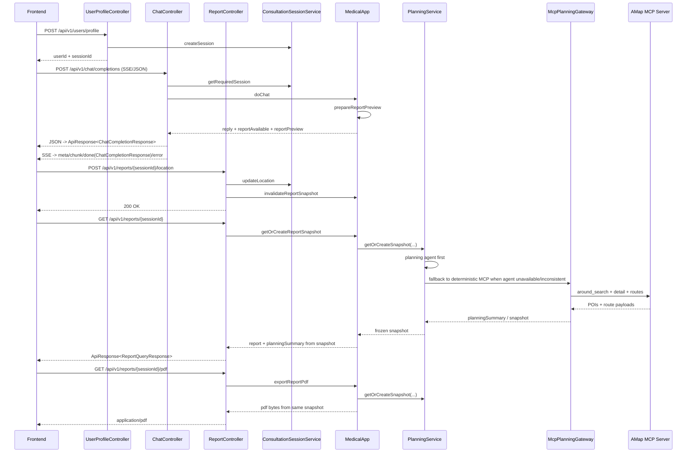

# MedicalAgent 前端联调协议 v2 — 聊天前移式 MCP 医院规划版

> 基于 v1 协议，补充并固化 AMap MCP 前移链路：
> 1. 聊天返回 `reportPreview`
> 2. `/reports` 与 `/pdf` 读取同一份 frozen snapshot
> 3. 位置更新会使旧快照失效，下次聊天预览或报告查询再重建

---

## 1. 结论与适用范围

### 1.1 当前 AMap MCP 链路是否打通

是，已打通。

在有效配置下，后端可完成以下闭环：
1. 会话初始化与问诊对话。
2. 位置上报到会话。
3. 聊天在满足条件时生成 `reportPreview`；若已具备位置，则尝试医院与路线规划；若位置缺失，则返回报告主体并降级路线能力。
4. 报告查询读取同一份 frozen snapshot，不再单独重复重算。
5. PDF 导出与当前有效 snapshot 保持一致。

### 1.2 生效前提

1. `MEDICAL_MCP_ENABLED=true`
2. `MEDICAL_REPORT_PLANNING_MCP_ENABLED=true`
3. `AMAP_MAPS_API_KEY` 有效
4. DashScope 模型 key 有效（用于问诊与报告生成）

---

## 2. v2 接口清单

| 接口 | 方法 | 路径 | Accept | 说明 |
|---|---|---|---|---|
| 初始化用户资料 | POST | `/api/v1/users/profile` | `application/json` | 创建 userId/sessionId |
| 聊天（同步JSON） | POST | `/api/v1/chat/completions` | `application/json` | 返回 `reportAvailable/reportTriggerLevel/reportPreview` |
| 聊天（SSE） | POST | `/api/v1/chat/completions` | `text/event-stream` | `meta/chunk/done/error` |
| 上报会话位置（新增） | POST | `/api/v1/reports/{sessionId}/location` | `application/json` | 报告规划所需经纬度 |
| 查询报告（增强） | GET | `/api/v1/reports/{sessionId}` | `application/json` | 读取 frozen snapshot，返回 `hospitals/routesAvailable/routeStatusMessage` |
| 下载报告 PDF | GET | `/api/v1/reports/{sessionId}/pdf` | `application/pdf` | 读取 frozen snapshot 并导出 PDF |

说明：
1. 除 `/api/v1/reports/{sessionId}/pdf` 的成功响应外，其他接口返回 JSON 时统一使用 `ApiResponse<T>`：

```json
{
  "code": 200,
  "message": "success",
  "data": {}
}
```

2. `/api/v1/chat/completions` 同一路径支持两种返回：
   - `Accept: application/json` -> `ApiResponse<ChatCompletionResponse>`
   - `Accept: text/event-stream` -> SSE 事件流

---

## 3. 新增/增强接口定义

### 3.1 上报会话位置（新增）

- 方法：`POST`
- 路径：`/api/v1/reports/{sessionId}/location`
- Content-Type：`application/json`

请求体：

```json
{
  "latitude": 31.2304,
  "longitude": 121.4737,
  "consentGranted": true
}
```

响应：

```json
{
  "code": 200,
  "message": "success",
  "data": null
}
```

校验约束：
1. `consentGranted=true` 才会写入。
2. `latitude` 范围 `[-90, 90]`。
3. `longitude` 范围 `[-180, 180]`。

前端匹配建议：
1. 建议在用户进入问诊后尽早完成位置上报，而不是等到点 `Generate Report` 才补。
2. 若授权被拒绝，应提供降级提示：聊天仍可返回 `reportPreview` 主体，但 `routesAvailable=false`。
3. 位置更新成功后，旧 frozen snapshot 会失效；后续聊天预览或 `/reports` 会基于新位置重建。

---

### 3.2 聊天返回（增强）

- 方法：`POST`
- 路径：`/api/v1/chat/completions`
- Content-Type：`application/json`

请求体：

```json
{
  "sessionId": "sess_xxx",
  "message": "我这两天胸闷，偶尔心慌",
  "attachments": []
}
```

同步 JSON 响应：

```json
{
  "code": 200,
  "message": "success",
  "data": {
    "sessionId": "sess_xxx",
    "reply": "...",
    "structuredReply": {
      "riskLevel": "中",
      "summary": "...",
      "basis": ["..."],
      "nextSteps": ["..."],
      "escalationSignals": ["..."],
      "followUpQuestions": ["..."],
      "disclaimer": "本回答由AI生成，仅供健康信息参考，不能替代医生面诊。"
    },
    "reportAvailable": true,
    "reportReason": "风险较高，可立即生成诊断报告协助就医。",
    "reportTriggerLevel": "urgent",
    "reportActionText": "风险较高，可立即生成诊断报告协助就医。",
    "reportGenerated": false,
    "report": null,
    "reportPreview": {
      "title": "...",
      "riskLevel": "中风险",
      "summary": "...",
      "assessment": "...",
      "basis": ["..."],
      "recommendations": ["..."],
      "redFlags": ["..."],
      "hospitals": [
        {
          "name": "...",
          "address": "...",
          "tier3a": true,
          "distanceMeters": 1200,
          "routes": [
            {
              "mode": "WALK",
              "distanceMeters": 1500,
              "durationMinutes": 18,
              "summary": "步行方案",
              "steps": [
                "步行200米前往地铁站",
                "出站后步行300米到达医院"
              ]
            }
          ]
        }
      ],
      "routesAvailable": true,
      "routeStatusMessage": "",
      "disclaimer": "本报告由AI生成，仅供参考，不能替代专业医生诊断。"
    },
    "ragApplied": true,
    "sources": [
      {
        "sourceId": "kb-xxx",
        "title": "xxx",
        "section": "xxx",
        "score": 0.03
      }
    ]
  }
}
```

语义说明：
1. `reportPreview` 是聊天内预览，不替代 `reportGenerated/report` 语义。
2. `reportPreview!=null` 表示当前会话已生成或复用了 frozen snapshot。
3. `reportPreview.routesAvailable=false` 时，前端仍可展示报告摘要与医院列表，同时展示 `routeStatusMessage`。
4. 若本轮未触发报告/医院规划，`reportPreview=null`。
5. 若当前会话尚未上报位置，则 `reportPreview` 仍可能存在，但通常表现为：
   - `hospitals=[]`
   - `routesAvailable=false`
   - `routeStatusMessage="未上传经纬度，无法进行就近医院规划"`
6. `attachments` 字段当前仅作占位，传入非空数组会返回 `400`。
7. `routes[].steps` 为可选分步路线数组，前端可直接渲染 Timeline/步骤卡片。

前端匹配建议：
1. 解析同步 JSON 时，业务字段应从 `data` 下读取，而不是直接从响应根节点读取。
2. 侧边栏处于 `review` 阶段时，可直接使用 `data.reportPreview` 做“预览卡片”。
3. 用户点击 `Generate Report` 后，再通过 `/reports/{sessionId}` 拉取正式视图。
4. 若用户刚完成位置上报，则不要继续依赖位置上报前的旧 `reportPreview`；应重新聊天或直接调用 `/reports/{sessionId}` 获取最新 snapshot。

SSE 事件流响应：

事件名与 payload 如下：

1. `meta`

```json
{
  "sessionId": "sess_xxx"
}
```

2. `chunk`

```json
{
  "delta": "风险等级：中",
  "index": 0
}
```

3. `done`

说明：`done` 事件直接返回完整 `ChatCompletionResponse` 业务对象，不再包 `ApiResponse`。

```json
{
  "sessionId": "sess_xxx",
  "reply": "...",
  "reportAvailable": true,
  "reportReason": "...",
  "reportTriggerLevel": "urgent",
  "reportActionText": "...",
  "reportGenerated": false,
  "report": null,
  "reportPreview": {},
  "ragApplied": true,
  "sources": []
}
```

4. `error`

```json
{
  "code": "SESSION_NOT_FOUND",
  "message": "会话不存在"
}
```

---

### 3.3 报告查询（增强）

- 方法：`GET`
- 路径：`/api/v1/reports/{sessionId}`

响应：

```json
{
  "code": 200,
  "message": "success",
  "data": {
    "ready": true,
    "reason": "报告生成完毕",
    "report": {
      "title": "...",
      "riskLevel": "中",
      "summary": "...",
      "assessment": "...",
      "basis": ["..."],
      "recommendations": ["..."],
      "redFlags": ["..."],
      "hospitals": [
        {
          "name": "...",
          "address": "...",
          "tier3a": true,
          "distanceMeters": 2332,
          "routes": [
            {
              "mode": "WALK",
              "distanceMeters": 581,
              "durationMinutes": 8,
              "summary": "步行方案",
              "steps": [
                "步行200米前往地铁站",
                "出站后步行300米到达医院"
              ]
            }
          ]
        }
      ],
      "routesAvailable": true,
      "routeStatusMessage": "",
      "disclaimer": "本报告由AI生成，仅供参考，不能替代专业医生诊断。"
    }
  }
}
```

状态语义：
1. `ready=false`：报告尚不可生成或内容不足，此时 `report=null`，`reason` 通常会给出说明。
2. `ready=true && report!=null`：可展示报告并开放 PDF 下载；若 snapshot 未因对话、画像或位置变化而失效，则内容通常与最近一次有效 `reportPreview` 保持一致。
3. `routesAvailable=true`：至少检测到可用路线工具并返回路线。
4. `routesAvailable=false`：路线不可用，参考 `routeStatusMessage`。
5. 若用户在拿到聊天预览后又调用了 `/location`，旧 snapshot 已被失效；此时本接口返回的正式报告可能比旧 `reportPreview` 更新。

前端匹配建议：
1. 侧边栏 `generated` 阶段以 `data.ready=true && data.report!=null` 为准。
2. `/reports` 会优先读取 frozen snapshot；若会话对话、画像或位置发生变化，后端会重建 snapshot。
3. 路线 UI 逻辑：
   - `routesAvailable=true`：展示路线卡片。
   - `routesAvailable=false`：展示 `routeStatusMessage` 并保留医院列表。

---

### 3.4 PDF 下载（与报告规划一致）

- 方法：`GET`
- 路径：`/api/v1/reports/{sessionId}/pdf`
- 响应：`application/pdf`

行为说明：
1. 后端优先读取当前 frozen snapshot；若 snapshot 已失效，则按当前会话状态重建后再导出。
2. PDF 内容与当前有效 snapshot 保持一致。
3. 成功时返回 `application/pdf`；若下载失败（如会话不存在、报告尚不可导出），则返回 JSON `ApiResponse<Void>`。
4. 若报告尚不可导出，返回 `409 Conflict`。

---

## 4. 后端模块工作流（生成报告场景）

```mermaid
flowchart TD
    A[Frontend: Start Consultation] --> B[POST /api/v1/users/profile]
    B --> C[UserProfileController]
    C --> D[MedicalApp.saveUserProfileMemory]
    C --> E[ConsultationSessionService.createSession]
    E --> F[(SessionStore)]

    G[Frontend: Chat] --> H[POST /api/v1/chat/completions]
    H --> I[ChatController]
    I --> J[ConsultationSessionService.getRequiredSession]
    I --> K[MedicalApp.doChat]
    K --> L[Medical agent runtime + RAG]
    L --> M[MedicalApp.prepareReportPreview]
    M --> N[MedicalReportSnapshotService getOrCreate]
    N --> O[MedicalHospitalPlanningService]
    O --> P{Agent planner result usable?}
    P -->|yes| Q[Use agent planning result]
    P -->|no| R1[McpMedicalHospitalPlanningGateway]
    R1 --> S1[AMap MCP tools]
    S1 --> T[(ReportSnapshotStore)]
    Q --> T
    T --> U[ChatCompletionResponse reportPreview]

    L1[Frontend: Upload Location] --> L2[POST /api/v1/reports/{sessionId}/location]
    L2 --> L3[ReportController.updateLocation]
    L3 --> L4[ConsultationSessionService.updateLocation]
    L3 --> L5[MedicalApp.invalidateReportSnapshot]
    L4 --> F

    G1[Frontend: Generate Report] --> G2[GET /api/v1/reports/{sessionId}]
    G2 --> G3[ReportController.getReport]
    G3 --> G4[MedicalApp.getOrCreateReportSnapshot]
    G4 --> G5[MedicalReportSnapshotService getOrCreate]
    G5 --> G6[(ReportSnapshotStore)]
    G6 --> G7[ApiResponse ReportQueryResponse]

    P1[Frontend: Download PDF] --> P2[GET /api/v1/reports/{sessionId}/pdf]
    P2 --> P3[ReportController.downloadReportPdf]
    P3 --> P4[MedicalApp.exportReportPdf]
    P4 --> P5[MedicalReportSnapshotService getOrCreate]
    P5 --> P6[(ReportSnapshotStore)]
    P6 --> P7[DefaultMedicalReportPdfExportService]
    P7 --> P8[MedicalReportPdfRenderer]
    P8 --> P9[PDF bytes]
```

---

## 5. 前端需要匹配的模块（v2）

### 5.1 API 层

1. 新增 `updateReportLocation(sessionId, latitude, longitude, consentGranted)`。
2. 除 PDF 成功响应外，所有返回 JSON 的接口都需要先解析统一包装：`code/message/data`。
3. `chat/completions` 返回新增字段：
   - `reportPreview`
   - `reportReason`
   - `ragApplied`
   - `sources`
4. `getReport` 的 `ReportViewDto` 增加字段：
   - `hospitals`
   - `routesAvailable`
   - `routeStatusMessage`
5. SSE `done` 事件返回 `ChatCompletionResponse` 业务对象本体，不包 `ApiResponse`。
6. `attachments` 当前必须传空数组或不传；非空会返回 `400`。
7. `downloadReportPdf` 路径不变，但语义改为读取当前有效 snapshot 导出。

### 5.2 状态机层

建议在 v1 四阶段基础上补充“位置上报状态与 snapshot 刷新规则”，而不是把 location 成功当作硬性 gate：
1. `review` 阶段即可展示 `reportPreview`。
2. `review -> generated` 触发前，不再强制要求重新计算；`GET /reports` 会读取当前有效 snapshot。
3. 若用户在 `review` 阶段补传位置，前端应视为旧预览失效，重新拉取 `/reports` 或等待下一次聊天刷新预览。
4. 若 location 缺失，前端提示“报告预览可用，但路线能力受限”。

### 5.3 UI 层

1. 报告侧边栏展示医院列表和路线列表。
2. 聊天区可展示 `reportPreview` 摘要卡片。
3. 当 `routesAvailable=false` 时：
   - 显示 `routeStatusMessage`
   - 医院列表照常展示（降级体验）
4. 当 `ready=false` 时，以 `reason` 作为禁用生成态提示。
5. 生成 PDF 后可显示“PDF 内容与当前正式报告一致（含医院规划）”。

---

## 6. 时序图（前后端交互）



---

## 7. 错误与降级语义（前端可见）

JSON 接口：
1. 所有 JSON 错误响应都遵循 `ApiResponse<Void>`，HTTP 状态码与 `code` 对齐。
2. `ready=false`：继续问诊，不展示下载按钮。
3. `routesAvailable=false`：报告可展示，路线卡片降级为空，显示 `routeStatusMessage`。
4. `/pdf` 返回 `409`：报告尚不可导出（通常是问诊轮次/内容不足）。
5. `/location` 返回 `400`：包括未授权、经纬度越界、请求体格式错误。
6. `/chat/completions`、`/reports/{sessionId}`、`/reports/{sessionId}/pdf` 返回 `404`：会话不存在。
7. `/chat/completions` 返回 `400`：当前最常见场景是 `attachments` 非空。
8. `/chat/completions` 返回 `429/503`：模型服务繁忙、暂不可用或网络异常。

SSE `error` 事件：
1. SSE 模式下，运行期失败通常通过 `error` 事件下发，前端不能只依赖 HTTP 状态码判断是否成功。
2. `SESSION_NOT_FOUND`：会话不存在。
3. `UNSUPPORTED_ATTACHMENTS`：暂不支持附件上传。
4. `MODEL_CONFIG_ERROR`：模型密钥或配置缺失。
5. `CHAT_RUNTIME_ERROR`：问诊生成失败。
6. `MODEL_UPSTREAM_UNAVAILABLE`：模型上游网络异常。
7. `INTERNAL_ERROR`：系统内部错误。

---

## 8. 对 v1 的兼容性

1. v1 客户端不调用 location 接口时，报告主干仍可工作。
2. v2 客户端建议增加 location 上报，以获得稳定医院路线规划能力。
3. 旧字段保持兼容，新增字段按可选处理，不会破坏既有渲染。
